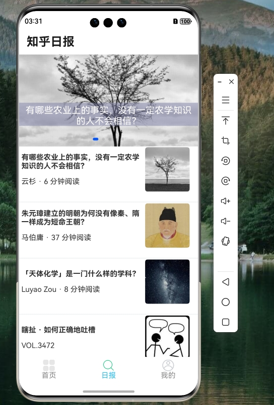

# HarmonyOS NEXT 仿知乎日报项目

<div align="center">
  
  <p><em>知乎日报 HarmonyOS NEXT 原生应用</em></p>
</div>

## 📖 项目简介

**ZhihuDaily** 是一个基于 HarmonyOS NEXT 原生开发的仿知乎日报应用程序。该项目展示了如何使用 ArkTS 和 ArkUI 开发完整的 HarmonyOS 应用，集成了网络请求、页面导航、状态管理等核心功能，并使用了坚果派团队开发的 `@nutpi/request` 网络库进行高效的网络通信。

### ✨ 核心特性

- **原生 HarmonyOS NEXT 开发** - 完全基于 ArkTS 和 ArkUI 框架
- **模块化网络请求** - 使用 `@nutpi/request` 网络库进行 RCP 远场通信
- **响应式 UI 设计** - 支持多种设备类型（手机、平板、2in1）
- **多页面导航** - 使用 Navigation 和 NavPathStack 实现页面跳转
- **数据懒加载** - 使用 LazyForEach 优化列表性能
- **下拉刷新与上拉加载** - 完整的列表交互体验
- **轮播图展示** - 支持自动播放和手动切换
- **详情页展示** - 富文本内容渲染

## 🚀 快速开始

### 环境要求

- **HarmonyOS SDK**: 5.0.0(12) 或更高版本
- **DevEco Studio**: 推荐使用最新版本
- **Node.js**: 16.x 或更高版本
- **ohpm**: OpenHarmony 包管理器

### 安装依赖

```shell
# 安装项目依赖
ohpm install

# 安装 @nutpi/request 网络库
ohpm install @nutpi/request
```

### 项目结构

```
zhihudaily/
├── AppScope/                    # 应用级配置
│   ├── app.json5               # 应用配置
│   └── resources/              # 应用资源
├── entry/                      # 主模块
│   ├── src/main/
│   │   ├── ets/
│   │   │   ├── common/         # 公共代码
│   │   │   │   ├── api/        # API 接口
│   │   │   │   └── bean/       # 数据类型定义
│   │   │   ├── entryability/   # 应用入口能力
│   │   │   ├── pages/          # 页面组件
│   │   │   │   ├── home/       # 首页
│   │   │   │   ├── zhihu/      # 知乎日报页面
│   │   │   │   │   └── detail/ # 详情页面
│   │   │   │   └── mine/       # 我的页面
│   │   │   └── utils/          # 工具类
│   │   ├── resources/          # 模块资源
│   │   └── module.json5        # 模块配置
│   ├── build-profile.json5     # 构建配置
│   └── oh-package.json5        # 模块依赖
├── doc/                        # 文档
├── build-profile.json5         # 项目构建配置
├── oh-package.json5            # 项目依赖
├── hvigorfile.ts               # 构建脚本
└── README.md                   # 项目说明文档
```

## 📱 功能模块

### 1. 首页 (Home)
- 基础页面展示
- 预留功能扩展接口

### 2. 知乎日报 (Zhihu)
- **轮播图展示** - 顶部新闻轮播，支持自动播放
- **新闻列表** - 分页加载每日新闻
- **下拉刷新** - 刷新最新内容
- **上拉加载** - 加载历史新闻
- **日期分组** - 按日期显示新闻列表

### 3. 新闻详情 (Detail)
- **富文本渲染** - 支持段落、加粗文本、图片等
- **作者信息** - 显示作者头像和简介
- **图片展示** - 自适应图片显示

### 4. 我的页面 (Mine)
- **用户登录** - 登录按钮
- **功能入口** - 收藏、历史记录等功能
- **设置选项** - 消息、反馈、关于等

## 🔧 技术架构

### 核心技术栈

- **开发语言**: ArkTS (TypeScript for HarmonyOS)
- **UI 框架**: ArkUI (声明式 UI 框架)
- **网络库**: @nutpi/request (基于 RCP 远场通信)
- **状态管理**: @State, @Prop 装饰器
- **导航系统**: Navigation, NavPathStack
- **构建工具**: Hvigor

### 核心组件

1. **网络请求封装** (`utils/http.ts`)
   - 基于 `@nutpi/request` 的 HTTP 客户端
   - 拦截器配置
   - 统一错误处理

2. **数据模型** (`common/bean/ApiTypes.ts`)
   - TypeScript 接口定义
   - 严格的类型检查
   - 响应数据结构

3. **页面组件** (`pages/`)
   - 使用 @Entry 和 @Component 装饰器
   - 生命周期管理 (aboutToAppear, aboutToDisappear)
   - 状态驱动 UI 更新

## 📡 API 接口

### 基础配置
```typescript
// utils/http.ts
const config: HttpRequestConfig = {
  baseURL: "http://175.178.126.10:8000/api/v1",
  validateStatus: (status) => status >= 200 && status < 300
}
```

### 知乎日报接口

#### 获取新闻列表
```typescript
// common/api/zhihu.ts
export const getZhiHuNews = (date: string): Promise<BaseResponse<ZhiNewsRespData>> => 
  http.get('/zhihunews/' + date);
```

**请求参数**:
- `date`: 日期字符串，格式 `YYYYMMDD`（如：20240720）

**响应数据结构**:
```typescript
interface ZhiNewsRespData {
  code: number;
  message: string;
  stories: ZhiNewsItem[];
  top_stories: ZhiNewsItem[];
  date: string;
}

interface ZhiNewsItem {
  id: string;
  image: string;
  title: string;
  url: string;
  hint: string;
  date: string;
  isShowDivider?: boolean;
}
```

#### 获取新闻详情
```typescript
export const getZhiHuDetail = (id: string): Promise<BaseResponse<ZhiDetailRespData>> => 
  http.get('/zhihudetail/' + id);
```

**请求参数**:
- `id`: 新闻 ID

**响应数据结构**:
```typescript
interface ZhiDetailRespData {
  code: number;
  message: string;
  content: ZhiDetailItem[];
  title: string;
  author: string;
  bio: string;
  avatar: string;
  image: string;
  more: string;
}

interface ZhiDetailItem {
  types: string;  // 'p' | 'p.strong' | 'img'
  value: string;
}
```

## 🛠️ 开发指南

### 1. 环境搭建

1. **安装 DevEco Studio**
   - 下载地址: [DevEco Studio 官网](https://developer.harmonyos.com/cn/develop/deveco-studio)
   - 安装 HarmonyOS SDK 5.0.0(12) 或更高版本

2. **配置 ohpm**
   ```shell
   # 安装 ohpm
   npm install -g @ohos/ohpm-cli
   
   # 验证安装
   ohpm -v
   ```

### 2. 项目导入

1. 打开 DevEco Studio
2. 选择 "Open" 或 "Import"
3. 选择项目根目录
4. 等待依赖下载和项目同步完成

### 3. 运行项目

1. **连接设备或模拟器**
   - 确保设备已开启开发者模式
   - 连接 USB 或使用远程模拟器

2. **构建并运行**
   - 点击工具栏中的运行按钮
   - 选择目标设备
   - 等待构建完成并自动安装应用

### 4. 调试技巧

#### 日志输出
```typescript
import { Log } from './utils/logutil';

// 不同级别的日志
Log.debug('调试信息');
Log.info('普通信息');
Log.warn('警告信息');
Log.error('错误信息');
```

#### 网络请求调试
```typescript
// 在 http.ts 中添加拦截器日志
httpClient.requestInterceptor.onFulfilled = (config?: HttpRequestConfig) => {
  Log.debug('请求拦截', JSON.stringify(config));
  return config;
};

httpClient.responseInterceptor.onFulfilled = (response?: HttpResponse) => {
  Log.debug('响应拦截', JSON.stringify(response));
  return response;
};
```

## 🔍 核心实现

### 1. 轮播图组件

```typescript
// Zhihu.ets 中的轮播图实现
Swiper(this.swiperController) {
  LazyForEach(this.swiperData, (item: ZhiNewsItem) => {
    Stack({ alignContent: Alignment.Center }) {
      Image(item.image)
        .width('100%')
        .height(200)
        .onClick(() => {
          this.pageStack.pushDestinationByName("ZhiPageDetail", { id: item.id });
        })
      
      Text(item.title)
        .padding(5)
        .margin({ top: 60 })
        .width('100%').height(50)
        .textAlign(TextAlign.Center)
        .maxLines(2)
        .fontSize(20)
        .fontColor(Color.White)
        .backgroundColor('#808080AA')
        .zIndex(2)
    }
  }, (item: ZhiNewsItem) => item.id)
}
.cachedCount(2)
.autoPlay(true)
.interval(4000)
.loop(true)
```

### 2. 列表懒加载

```typescript
// 自定义数据源实现
class BasicDataSource<T> implements IDataSource {
  private listeners: DataChangeListener[] = [];
  private originDataArray: T[] = [];

  totalCount(): number {
    return this.originDataArray.length;
  }

  getData(index: number): T {
    return this.originDataArray[index];
  }

  registerDataChangeListener(listener: DataChangeListener): void {
    if (this.listeners.indexOf(listener) < 0) {
      this.listeners.push(listener);
    }
  }

  notifyDataReload(): void {
    this.listeners.forEach(listener => {
      listener.onDataReloaded();
    })
  }
}
```

### 3. 下拉刷新与上拉加载

```typescript
Refresh({ refreshing: $$this.isRefreshing, offset: 120, friction: 100 }) {
  List({ space: 1 }) {
    ForEach(this.zhiNews, (item: ZhiNewsItem, idx) => {
      ListItem() {
        // 列表项内容
      }
    })
  }
  .onReachEnd(() => {
    this.isEnd = true;
    this.getMoreNews(); // 加载更多数据
  })
}
.onRefreshing(() => {
  setTimeout(() => {
    this.isRefreshing = false;
  }, 1000);
  // 刷新逻辑
})
```

## 📱 页面路由配置

### module.json5 配置

```json5
{
  "module": {
    "name": "entry",
    "type": "entry",
    "mainElement": "EntryAbility",
    "deviceTypes": ["phone", "tablet", "2in1"],
    "requestPermissions": [{
      "name": "ohos.permission.INTERNET"
    }],
    "pages": "$profile:main_pages",
    "abilities": [{
      "name": "EntryAbility",
      "srcEntry": "./ets/entryability/EntryAbility.ets",
      "exported": true,
      "skills": [{
        "entities": ["entity.system.home"],
        "actions": ["action.system.home"]
      }]
    }]
  }
}
```

### 页面路由

```typescript
// 页面跳转示例
this.pageStack.pushDestinationByName("ZhiPageDetail", { id: item.id })
  .catch((e: Error) => {
    console.log(`catch exception: ${JSON.stringify(e)}`);
  })
  .then(() => {
    // 跳转成功
  });
```

## 🧪 测试与构建

### 单元测试

项目包含基本的测试框架配置：

```json5
// oh-package.json5
{
  "devDependencies": {
    "@ohos/hypium": "1.0.19",
    "@ohos/hamock": "1.0.0"
  }
}
```

### 构建配置

```json5
// build-profile.json5
{
  "app": {
    "signingConfigs": [],
    "products": [{
      "name": "default",
      "signingConfig": "default",
      "compatibleSdkVersion": "5.0.0(12)",
      "runtimeOS": "HarmonyOS"
    }]
  },
  "modules": [{
    "name": "entry",
    "srcPath": "./entry"
  }]
}
```

### 构建命令

```shell
# 调试构建
hvigorw assembleHap --mode debug

# 发布构建
hvigorw assembleHap --mode release

# 清理构建
hvigorw clean
```

## 🔗 相关资源

### 官方文档
- [HarmonyOS 开发者官网](https://developer.harmonyos.com/)
- [ArkTS 语言指南](https://developer.harmonyos.com/cn/docs/documentation/doc-guides/arkts-get-started-0000001774119986)
- [ArkUI 开发指南](https://developer.harmonyos.com/cn/docs/documentation/doc-guides/arkui-get-started-0000001820879613)

### 网络库
- [@nutpi/request](https://ohpm.openharmony.cn/#/cn/detail/@nutpi%2Frequest) - 坚果派网络请求库
- [详细实现原理](https://blog.csdn.net/yyz_1987/article/details/143881288) - 远场通信 RCP 模块化封装

### 知乎日报 API
- 最新日报: `GET https://news-at.zhihu.com/api/4/news/latest`
- 历史日报: `GET https://news-at.zhihu.com/api/4/news/before/{date}`
- 日报详情: `GET https://news-at.zhihu.com/api/4/news/{id}`

## 🤝 贡献指南

### 开发流程

1. **Fork 项目**
2. **创建功能分支**
   ```shell
   git checkout -b feature/your-feature-name
   ```
3. **提交更改**
   ```shell
   git commit -m "feat: add some feature"
   ```
4. **推送分支**
   ```shell
   git push origin feature/your-feature-name
   ```
5. **创建 Pull Request**

### 代码规范

1. **命名规范**
   - 组件名使用 PascalCase
   - 变量名使用 camelCase
   - 常量使用 UPPER_CASE

2. **代码风格**
   - 使用 2 空格缩进
   - 字符串使用单引号
   - 添加必要的类型注解

3. **提交信息**
   - feat: 新功能
   - fix: 修复 bug
   - docs: 文档更新
   - style: 代码格式调整
   - refactor: 代码重构
   - test: 测试相关

## 📄 许可证

本项目基于 Apache License 2.0 许可证开源。详情请查看 [LICENSE](LICENSE) 文件。

## 👥 团队信息

**坚果派团队** - 由坚果等人创建，团队拥有12个华为HDE带领热爱HarmonyOS/OpenHarmony的开发者，以及若干其他领域的三十余位万粉博主运营。专注于分享HarmonyOS/OpenHarmony、ArkUI-X、元服务、仓颉。团队成员聚集在北京，上海，南京，深圳，广州，宁夏等地，目前已开发鸿蒙原生应用，三方库60+，欢迎交流。

### 作者
- [猫哥](blog.csdn.net/qq8864)

### 开源地址
- Gitee: https://gitee.com/yyz116/request

## 🐛 问题反馈

如果您在使用过程中遇到任何问题，请通过以下方式反馈：

1. 在 GitHub/Gitee 上提交 Issue
2. 检查现有 Issue 列表，避免重复提交
3. 提供详细的复现步骤和环境信息

## 📈 未来规划

- [ ] 添加收藏功能
- [ ] 实现离线缓存
- [ ] 支持主题切换
- [ ] 添加分享功能
- [ ] 优化图片加载性能
- [ ] 增加单元测试覆盖率
- [ ] 支持更多设备类型

---

<div align="center">
  <p>感谢使用 HarmonyOS NEXT 仿知乎日报项目！</p>
  <p>如果您觉得这个项目对您有帮助，请给个 ⭐️ 支持一下！</p>
</div>